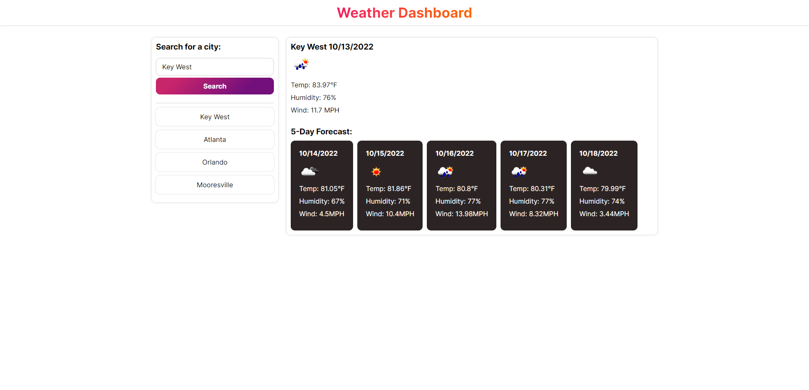

# Jason's Weather Dashboard

## Description
I was able to build a weather dashboard that runs in the browser and features dynamically updated HTML and CSS. You are able to search for a city. Once searched, the city is added to a left toolbar. 

### Screenshot

### Link to Live Site
<a href="https://jrettinger.github.io/weather-dashboard/" target= blank>Link to live site</a>